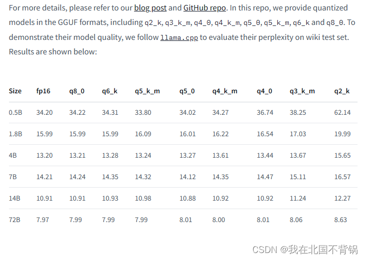

# GGUF（GGML）
本质是一种特殊格式，而非量化算法。允许用户使用CPU运行LLM，也可以局部加载到GPU里。由FaceBook的LLAMA团队剔除。
## 各类参数对比

原文链接：https://blog.csdn.net/weixin_44455388/article/details/136500170

> q8_0：与浮点数16几乎无法区分。资源使用率高，速度慢。不建议大多数用户使用。
q6_k：将Q8_K用于所有张量。
q5_k_m：将 Q6_K 用于一半的 attention.wv 和 feed_forward.w2 张量，否则Q5_K。
q5_0： 原始量化方法，5位。精度更高，资源使用率更高，推理速度更慢。
q4_k_m：将 Q6_K 用于一半的 attention.wv 和 feed_forward.w2 张量，否则Q4_K
q4_0：原始量化方法，4 位。
q3_k_m：将 Q4_K 用于 attention.wv、attention.wo 和 feed_forward.w2 张量，否则Q3_K
q2_k：将 Q4_K 用于 attention.vw 和 feed_forward.w2 张量，Q2_K用于其他张量。

## GPTQ的各类方法
post-Trainging Quantization是一种后训练方法，直接把全精度转换为int8，int4等格式。但是可能回出现明显的性能下降。GPTQ核心思想是最小化该权重的均方误差，把权重压缩到4位。推理过程中再动态的权重量化为float16，提高性能。

## 其他参考
https://www.onetts.com/tutorial/qwen-model-quantifies-gguf（gguf的使用教程，手把手教你量化QWEN模型）
https://www.oldming.cn/archives/GGUF
https://blog.csdn.net/weixin_44455388/article/details/136500170
https://blog.csdn.net/linzhiji/article/details/138912632
